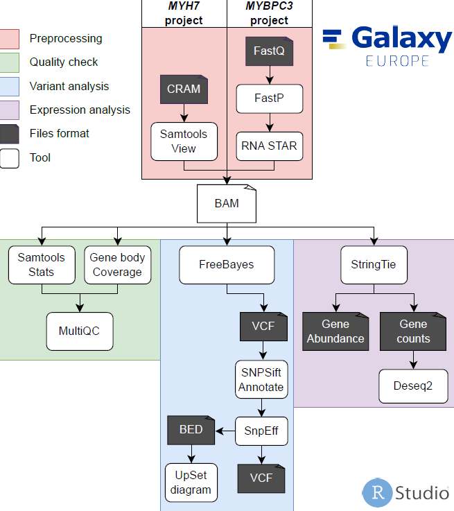
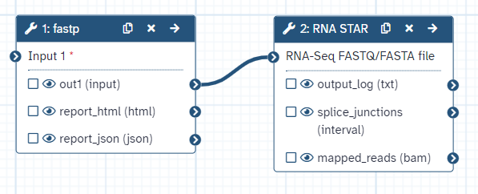
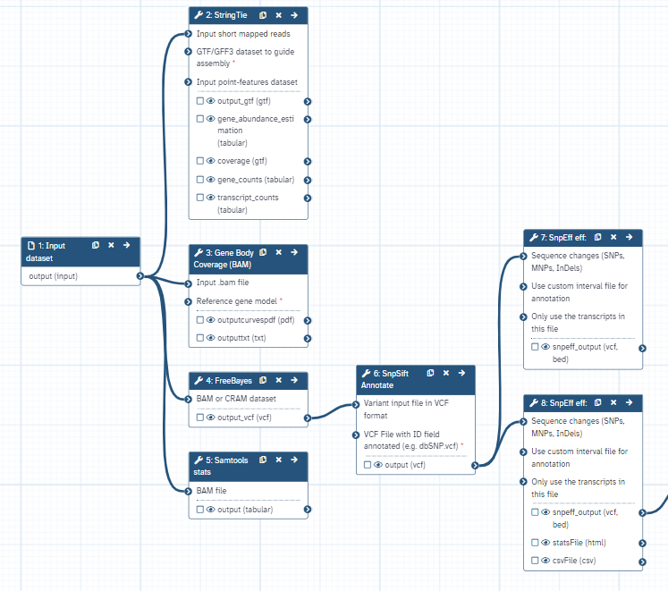
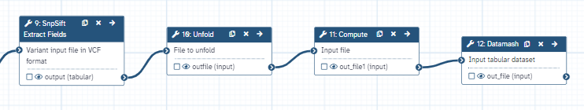
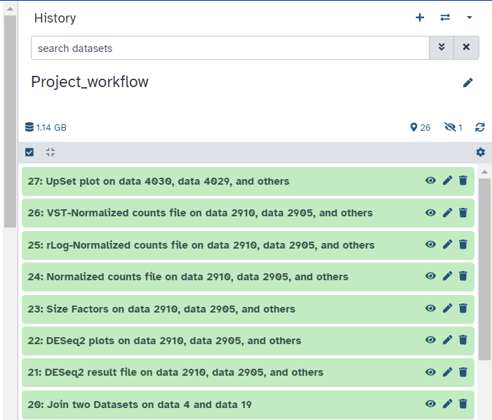

# Galaxy_RNAseq_RNA_variants

<!-- TABLE OF CONTENTS -->

  
Table of Contents

  <ol>
    <li><a href="#about-the-project">About The Project</a></li>
    <li><a href="#Galaxy-pipeline">Galaxy-pipeline</a>
      <ul>
        <li><a href="#Conversion-CRAM-to-BAM">Conversion CRAM to BAM</a></li>
        <li><a href="#FastQ-to-BAM">FastQ to BAM</a></li>
        <li><a href="#Complete-workflow-BAM-to-output">Complete workflow BAM to output</a></li>
      </ul>
    </li>
    <li><a href="#r-scripts">R scripts</a></li>
    <li><a href="#local-galaxy">Local Galaxy</a>
      <ul>
        <li><a href="#DRE-guides">DRE guides</a></li>
        <li><a href="#In-a-Windows-VM">In a Windows VM</a></li>
      </ul>
    </li>
    <li><a href="#acknowledgments">Acknowledgments</a></li>
  </ol>

<!-- ABOUT THE PROJECT -->
## About The Project

  Identifying RNA variants in hypertrophic cardiomyopathy pluripotent stem cells derived cardiomyocyte models

<!-- galaxy -->
## Galaxy pipeline

  

 

## Conversion CRAM to BAM

  Example histories can be used to see what was exactly run in the workflow file with the output. Till Galaxy decides to corrupt the history. However, I would use the "collection" option and run these tools separately instead of using the workflow. This keeps the filenames unchanged in the collection and saves time of renaming the files one by one. All output generated during this project can be found on the UMCU workstation.

  Workflow file: Galaxy-Workflow-CRAM-SAM-BAM-VCF.ga
   
  Example history of 1 file: <a href="https://usegalaxy.eu/u/vanessa1/h/nottinghampreprocess" target="_blank">Example_run</a>
  <ol>
    <li>Samtools view</li>
    <li>Replace chromosome names, use chromosome_replace.txt</li>
    <li>Samtools view</li>
    <li>AddOrReplaceReadGroups</li>
    <li>FreeBayes</li>    
  </ol>

  <ol>
    <li>Step 1: Samtools view
      <ul>
        <li>SAM/BAM/CRAM data set = Select at Runtime.</li>
        <li>What would you like to look at? = All reads in the input dataset</li>
        <li>What would you like to have reported? = The actual reads</li>
        <li>Read Reformatting Options:</li>
        <li>Collapse backward CIGAR operation = False</li>
        <li>Output format = SAM</li>
        <li>Include SAM header in the output? = False</li>
        <li>Use a reference sequence = Use a built-in genome</li>
        <li>Reference = hg19 Full</li>
      </ul>
    </li>
      <li>Step 2: Replace chromosome names
      <ul>
        <li>Tabular input dataset = Output 'outputsam' from Step 1.</li>
        <li>Columns on which to perform the replacement = 3</li>
        <li>Mapping table = Select at Runtime.</li>
        <li>Comment character = Empty.</li>
      </ul>
    </li>
      <li>Step 3: Samtools view
      <ul>
        <li>SAM/BAM/CRAM data set = Output 'output' from Step 2.</li>
        <li>What would you like to look at? = All reads in the input dataset</li>
        <li>What would you like to have reported? = The actual reads</li>
        <li>Read Reformatting Options:</li>
        <li>Collapse backward CIGAR operation = False</li>
        <li>Output format = BAM (-b)</li>
        <li>Use a reference sequence = Use a built-in genome</li>
        <li>Reference = hg19</li>
      </ul>
    </li>
      <li>Step 4: AddOrReplaceReadGroups
      <ul>
        <li>Select SAM/BAM dataset or dataset collection = Output 'outputsam' from Step 3.</li>
        <li>Auto-assign = True</li>
        <li>Auto-assign = True</li>
        <li>Auto-assign = True</li>
        <li>Platform/technology used to produce the reads (PL) = ILLUMINA</li>
        <li>Platform unit (PU) = run</li>
        <li>Sequencing center that produced the read (CN) = Not available.</li>
        <li>Description (DS) = Not available.</li>
        <li>Predicted median insert size (PI) = Not available.</li>
        <li>Date that run was produced (DT) = Not available.</li>
        <li>Select validation stringency = Lenient</li>        
      </ul>
    </li>
    <li>Step 5: FreeBayes
      <ul>
        <li>Choose the source for the reference genome = Locally cached</li>
        <li>Run in batch mode? = Run individually</li>
        <li>BAM or CRAM dataset = Output 'outFile' from Step 4.</li>
        <li>Using reference genome = hg19</li>
        <li>Limit variant calling to a set of regions? = Do not limit</li>
        <li>Read coverage = Use defaults</li>
        <li>Choose parameter selection level = 1. Simple diploid calling</li>
      </ul>
    </li>
  </ol>

## FastQ to BAM

  Workflow file: Galaxy-Workflow-Michigan_preproces.ga
   
  Example history of 1 file: <a href="https://usegalaxy.eu/u/vanessa1/h/michiganpreprocess" target="_blank">Example_run</a>

  

## Complete workflow BAM to output

  Workflow file: Galaxy-Workflow-Project_workflow.ga 
   
  Example histoty of 1 file: <a href="https://usegalaxy.eu/u/vanessa1/h/projectworkflow" target="_blank">Example_run</a>  
   
  

  Not visible in the Galaxy pipeline figure, but it is present in the workflow file. Text manipulation tools:
  <ol>
    <li>SNPSift Extract Fields</li>
    <li>Unfold</li>
    <li>Compute</li>
    <li>Datamash</li>
  </ol>
  

  Not visible due to the combination of multiple samples and the example history contains a run of 1 sample. My output with multiple samples is added to the example history.
  <ol>
    <li>Join two Datasets</li>
    <li>Deseq2</li>
    <li>UpSet diagram</li>
  </ol>
  

<!-- rscripts -->
## R scripts

  Datasets for plotting can be found on the UMC Utrecht workstation

<!-- Local galaxy -->
## Local Galaxy
## DRE guides

  <ol>
    <li>Resizing the <a href="https://support.mydre.org/portal/en/kb/articles/resizevm" target="_blank">VM</a></li>
    <li>Cannot connect to <a href="https://support.mydre.org/portal/en/kb/articles/i-cannot-connect-to-vm-1-2-3-error#Problem" target="_black">VM</a></li>
    <li>Log in via <a href="https://support.mydre.org/portal/en/kb/articles/connect-to-virtual-machine-using-bastion" target="_black">Bastion</a> on the workstation</li>
    <li>Proxy <a href="https://support.mydre.org/portal/en/kb/articles/proxy-configurations" target="_blank">configurations</a></li>
  </ol>

## In a Windows VM

  When in the Windows VM.
   
  1. Open cmd
   
  <code>ssh 10.xxx.xxx.xxx -l "youremail@mydre.org"</code>
   
  Type mydre password blindly and enter

  2. To get to /home
   
  <code>cd ..</code>

  3. To add more local admin users, go to this folder
   
  <code>cd /home/galaxy/group_vars</code>
   
  <code>sudo nano galaxyservers.yml</code>
  <ul>
    <li>Type mydre password blindly and enter</li>
    <li>Use arrow keys to scroll down</li>
    <li>Look for galaxy_config</li>
  </ul>
  <code>admin_users: admin@galaxy.org, "youremail@mail.org"</code>
   
  Make one on the local Galaxy instance by registering. These can be self-made and do not have to be real. 
   
   
  3b. The cores(threads) and ram(buffer-size) used by Galaxy can be found here as well.
   

  4. Status of used storage.
   
  <code>df -h</code>

  5. When full, empty temporary folder when many analysis were done.
   
  <code>cd /srv/galaxy/var/tmp</code>
   
  <code>ls</code>
   
  These files can be deleted. 
   
  <code>Warning: Be very careful when using sudo.</code>
  <code>sudo rm -r *</code>

<!-- acknowledgments -->
## Acknowledgments

